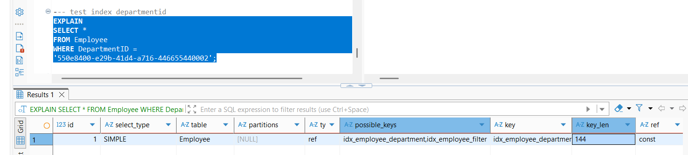
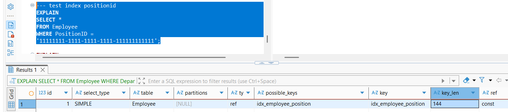
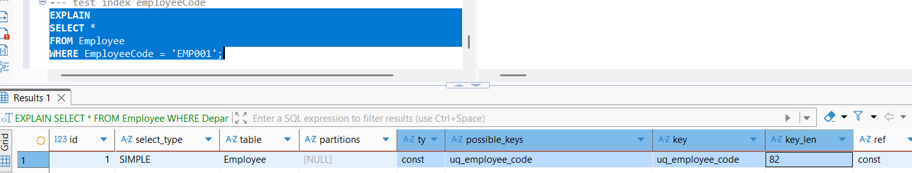
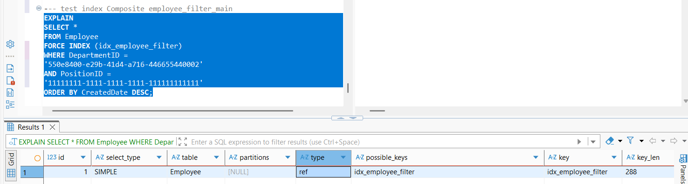

# Kết Quả Bài Tập

## Bài Tập Cấp Độ 1: Beginner

### Task 1.1: Hoàn Thiện CRUD cho Position (1 điểm)

#### Yêu cầu
- Tạo `PositionRepository` kế thừa `BaseRepository<Position>` - DONE
- Tạo `PositionService` kế thừa `BaseService<Position>` - DONE
- Tạo `PositionsController` kế thừa `BaseController<Position>` - DONE
- Đăng ký DI trong `ServiceExtensions.cs` - DONE

#### Kiểm tra
- [X] API `GET /api/Positions` trả về danh sách position
- [X] API `GET /api/Positions/{id}` trả về position theo id
- [X] API `POST /api/Positions` thêm mới position
  - fix lỗi:
    - sai utf dtb:

```sql
ALTER TABLE Position
CONVERT TO CHARACTER SET utf8mb4
COLLATE utf8mb4_0900_ai_ci;
```

  - Thiếu tạo ID trong repo => luôn lấy id 00000-000.. mặc định
- [X] API `PUT /api/Positions/{id}` cập nhật position
  - fix lỗi: setid sau set param nên id không lấy được
- [X] API `DELETE /api/Positions/{id}` xóa position

---

### Task 1.2: Hoàn Thiện CRUD cho Employee (1 điểm)

#### Yêu cầu
- Tạo `EmployeeRepository` kế thừa `BaseRepository<Employee>` - DONE
- Tạo `EmployeeService` kế thừa `BaseService<Employee>` - DONE
- Tạo `EmployeesController` kế thừa `BaseController<Employee>` - DONE
- Đăng ký DI trong `ServiceExtensions.cs` - DONE

#### Kiểm tra
- [X] API `GET /api/Employees` trả về danh sách employee
- [X] API `GET /api/Employees/{id}` trả về employee theo id
- [X] API `POST /api/Employees` thêm mới employee
  - fix lỗi:
    - sai utf dtb:

```sql
ALTER TABLE employee
CONVERT TO CHARACTER SET utf8mb4
COLLATE utf8mb4_0900_ai_ci;
```

- [X] API `PUT /api/Employees/{id}` cập nhật employee
- [X] API `DELETE /api/Employees/{id}` xóa employee

## Bài Tập Cấp Độ 2: Intermediate

### Task 2.1: Thêm Validation cho Employee (2 điểm)

#### Yêu cầu
- Thêm `[IRequired]` attribute cho các trường bắt buộc:
  - `EmployeeCode` - Mã nhân viên - DONE
  - `EmployeeName` - Tên nhân viên - DONE
  - `DepartmentID` - Phòng ban - DONE
  - `PositionID` - Vị trí - DONE
- Override method `ValidateCustom()` trong `EmployeeService` để thêm các validation tùy chỉnh:
  - Mã nhân viên không được trùng lặp - DONE
  - Email phải đúng định dạng (nếu có) - DONE
  - Số điện thoại phải đúng định dạng (nếu có) - DONE
  - Ngày sinh phải nhỏ hơn ngày hiện tại - DONE

#### Kiểm tra
- [X] POST employee thiếu các trường bắt buộc → trả về lỗi 400 với thông báo rõ ràng
- [X] POST employee có mã trùng lặp → trả về lỗi "Mã nhân viên đã tồn tại"
- [X] POST employee có email sai định dạng → trả về lỗi "Email không đúng định dạng" -->

---

### Task 2.2: Tạo API Lọc Employee Theo Điều Kiện (2 điểm)

#### Yêu cầu
- Thêm endpoint `GET /api/Employees/filter` với các tham số:
  - `departmentId` - Lọc theo phòng ban
  - `positionId` - Lọc theo vị trí
  - `salaryFrom` - Lọc lương từ
  - `salaryTo` - Lọc lương đến
  - `gender` - Lọc theo giới tính (0: Nam, 1: Nữ, 2: Khác)
  - `hireDateFrom` - Ngày vào làm từ
  - `hireDateTo` - Ngày vào làm đến

#### Kiểm tra
- [X] Gọi API với `departmentId` hợp lệ → trả về danh sách nhân viên trong phòng ban đó
- [X] Gọi API với nhiều điều kiện lọc → trả về kết quả đúng

---

### Task 2.3: Thêm Custom Endpoint Cho Department (2 điểm)

#### Yêu cầu
- Thêm endpoint `GET /api/Departments/{code}/employees` - Lấy danh sách nhân viên theo mã phòng ban
- Thêm endpoint `GET /api/Departments/{code}/employee-count` - Đếm số nhân viên trong phòng ban

#### Kiểm tra
- [X] `GET /api/Departments/DV/employees` → trả về danh sách nhân viên phòng ban DV
- [X] `GET /api/Departments/DV/employee-count` → trả về số lượng nhân viên

## Bài Tập Cấp Độ 3: Advanced

### Task 3.1: - Tối Ưu Performance (3 điểm)

#### Vấn đề
BaseRepository hiện tại mở connection mỗi lần gọi method, có thể gây performance issues.

#### Yêu cầu
- Refactor để sử dụng connection pooling hiệu quả hơn - DONE
  - Test cho API GetEntitiesUsingCommandTextAsync dùng using tạo connection để hết hàm sẽ tự dipose, không giữ lại như tạo trong constructor
- Thêm caching cho các truy vấn `GetEntities`, `GetEntityByID` với thời gian cache 5 phút - DONE
  - Hiện đang để cache sống 5 phút và gia hạn thêm 2 phút mỗi khi request
  - Dùng ImemoryCache cho GetEntities, GetEntityByID trong BaseService
  - Thêm RemoveCache để clear cache khi data change
  - delete thì truyền thêm id để xóa cache ở GetEntityByID nữa
- Đánh giá: Sử dụng `IMemoryCache` hoặc `IDistributedCache` - Dùng IMemoryCache

#### Kiểm tra
- [ ] Review code để đảm bảo không có breaking changes
- [ ] Test performance trước và sau khi refactor
- [ ] Đảm bảo cache được clear khi có thay đổi dữ liệu

---

### Task 3.2: Xử Lý Race Condition trong Validate (3 điểm)

#### Vấn đề
Khi nhiều request thêm mới cùng lúc, validation mã trùng có thể bị race condition.

#### Yêu cầu
- Sử dụng database-level constraint (unique index) cho `EmployeeCode`
  - thêm constraint UNIQUE cho employeecode trong DTB:

```sql
ALTER TABLE Employee
ADD CONSTRAINT uq_employee_code
UNIQUE (EmployeeCode);
```

- Xử lý exception khi duplicate xảy ra và trả về message phù hợp
  - Đã có tự viết Interfaces/Extensions/IUniqueMessages để custom message hợp lý dựa vào tên contraint
  - Tuy nhiên proc insert đã có custom signal message nên Interface này không cần nữa
- Đảm bảo transaction được handle đúng cách
  - Chỉ có 1 INSERT, không multi-table nên transaction không thực sự cần thiết

#### Kiểm tra
- [ ] Test gọi API POST 2 request cùng lúc với cùng EmployeeCode
- [ ] Chỉ 1 request thành công, 1 request trả về lỗi "Mã nhân viên đã tồn tại"

---

### Task 3.3: Thêm Paging Cho Employee Filter (3 điểm)

#### Vấn đề
Task 2.2 trả về tất cả kết quả, không có phân trang.

#### Yêu cầu
- Refactor endpoint filter để hỗ trợ paging
- Thêm parameters: `pageSize`, `pageIndex`
- Response trả về `PagingResponse<Employee>`

#### Kiểm tra
- [X] `GET /api/Employees/filter?departmentId=xxx&pageSize=10&pageIndex=1` → trả về 10 bản ghi đầu tiên
- [X] Response chứa thông tin `Total`, `PageSize`, `PageIndex`, `Data`

---

### Task 3.4: Tối Ưu SQL Query với Index (3 điểm)

#### Yêu cầu
- Phân tích các truy vấn trong codebase
- Đề xuất và tạo các index cần thiết cho bảng Employee:
  - Index trên `DepartmentID` (cho filter theo phòng ban)
  - Index trên `PositionID` (cho filter theo vị trí)
  - Index trên `EmployeeCode` (cho tìm kiếm theo mã)
  - Composite index cho các truy vấn thường dùng

#### Deliverable
- File SQL tạo index
- Giải thích tại sao cần các index này

```sql
ALTER TABLE Employee
ADD CONSTRAINT uq_employee_code
UNIQUE (EmployeeCode);
```

=> Tạo Constraint phục vụ Race Condition tránh trùng EmployeeCode ở Task 3.2 chính là tạo Index cho EmployeeCode rồi
-> Kiểm tra trùng mã nhân viên

```sql
CREATE INDEX idx_employee_department
ON Employee (DepartmentID);
```

=> Tạo Index cho DepartmentID
-> Giảm:
   - Số dòng cần đọc
   - Thời gian query

```sql
CREATE INDEX idx_employee_position
ON Employee (PositionID);
```

=> Tạo Index cho PositionID
-> Tìm nhanh nhân viên theo PositionID

```sql
CREATE INDEX idx_employee_filter
ON Employee (
    DepartmentID,
    PositionID,
    CreatedDate
);
```

=> Tạo Composite index cho truy vấn chung của proc_employee_filter
-> Tìm trực tiếp đúng dữ liệu Đã sắp xếp sẵn theo CreatedDate Không cần sort lại.

### Kết quả index

- Index trên `DepartmentID` (cho filter theo phòng ban)
  

- Index trên `PositionID` (cho filter theo vị trí)
  

- Index trên `EmployeeCode` (cho tìm kiếm theo mã)
  

- Composite index cho các truy vấn thường dùng
  

**Đã sửa entities employee thêm hiredatefrom và hiredateto + sửa table employee**

## Câu hỏi

### Cấp Độ 1

- Repository Pattern là gì? Tại sao sử dụng?

Repository Pattern là một design pattern dùng để tách logic truy cập dữ liệu (data access) ra khỏi business logic.
Nó đóng vai trò như một lớp trung gian giữa:
- Business Layer
- Data Access Layer (Database)

Lý do sử dụng:
1. Separation of Concerns
→ Tách business logic và data access
2. Dễ test (Unit Test)
→ Có thể mock repository
3. Dễ thay đổi database
→ Ví dụ chuyển từ SQL → MongoDB

- DI trong .NET Core hoạt động như thế nào?

Dependency Injection (DI) là kỹ thuật inject dependency từ bên ngoài thay vì tự tạo trong class.
.NET Core có built-in DI container.

Khi app start → đăng ký service
Khi cần → tạo instance
Inject vào constructor

Service Lifetime - 3 loại:
- Transient → tạo mới mỗi lần request
- Scoped → tạo 1 lần mỗi HTTP request
- Singleton → tạo 1 lần toàn app

- Sự khác biệt giữa `IBaseRepository` và `BaseRepository`?

| `IBaseRepository`     | `BaseRepository` |
| --------------------- | ---------------- |
| Interface             | Class            |
| Chỉ định nghĩa method | Implement method |
| Không có logic        | Có logic         |
| Dùng để inject        | Dùng để kế thừa  |

### Cấp Độ 2

- Validation ở tầng nào là tốt nhất? Tại sao?

Validation ở tầng logic nghiệp vụ (Application/Service) là tốt nhất vì:
Client có thể bị bypass

Ví dụ:
- Postman
- Curl
- Hacker

- Sự khác biệt giữa `[IRequired]` và DataAnnotations?

[Required] (DataAnnotations) là Built-in của .NET và tự validate. Được dùng cho:
- Model validation
- MVC
- API

[IRequired] (Custom Attribute) tự tạo dùng để tạo rule validation riêng, phải tự code logic và dùng cho custom framework

- Tại sao cần validate ở cả Client và Server?

Vì Client để UX, Server để Security.

Client Validation giúp:
- User biết lỗi ngay
- Giảm request sai
- UX tốt

Server Validation giúp:
- Bảo mật
- Ngăn dữ liệu sai
- Không phụ thuộc client

### Cấp Độ 3

- Caching strategy nào phù hợp cho API?

Tuỳ loại dữ liệu.

1. In-memory cache
Ví dụ: IMemoryCache
Phù hợp:
- Dữ liệu nhỏ
- Single server

2. Distributed cache (thường dùng nhất)
Ví dụ: Redis
Phù hợp:
- Multiple servers
- Microservices

3. Cache-Aside Pattern (phổ biến nhất)
Kiểm tra xem có cache không rồi mới query dtb

- Race condition xảy ra khi nào và cách xử lý?

Race condition xảy ra khi nhiều thread cùng truy cập và sửa dữ liệu cùng lúc.

Ví dụ:
- User A update balance
- User B update balance
- → sai dữ liệu

Cách xử lý:
1. Lock
2. Database Transaction
3. Optimistic Concurrency
4. Pessimistic Lock
   - Lock record trong DB.

- Index trong SQL hoạt động như thế nào?

Index giống mục lục của sách giúp tìm dữ liệu nhanh hơn do DTB được search theo index tree (B-Tree)
Index phù hợp với cột hay dùng trong WHERE, JOIN, ORDER BY
