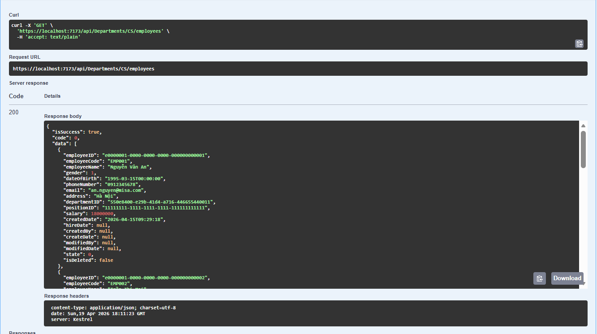
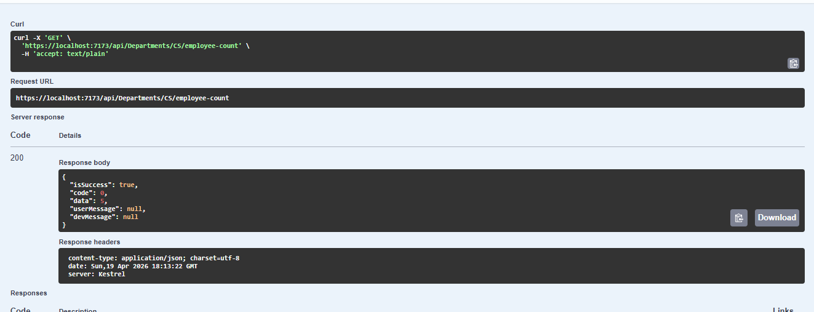
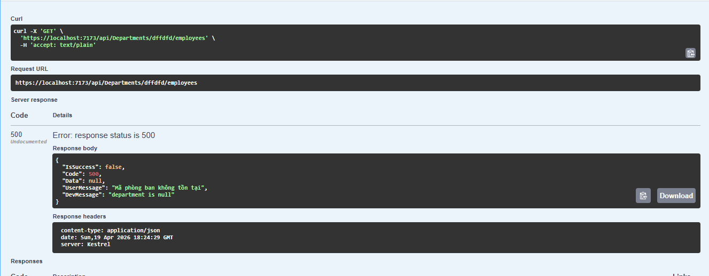

# Task 2.3: Endpoint Cho Department

## Luồng hoạt động


```
GET /api/Departments/{code}/employees
GET /api/Departments/{code}/employee-count
	|
	|-- Buoc 1: Controller nhận route param `{code}`
	|
	|-- Buoc 2: DepartmentsController goi DepartmentService
	|     -> GetEmployeesByDepartmentCodeAsync(code)
	|     -> GetEmployeeCountByDepartmentCodeAsync(code)
	|
	|-- Buoc 3: Service validate input
	|     -> {code} không được trống
	|
	|-- Buoc 4: Repository thực hiện truy vấn theo Query.json
	|     -> Department.GetEmployeesByCode
	|     -> Department.GetEmployeeCountByCode
	|
	|-- Buoc 5: DB join Department + Employee theo DepartmentID
	|     -> Lọc theo DepartmentCode
	|
	'-- Buoc 6: Trả về ServiceResponse
	      -> endpoint /employees: Data = danh sách Employee
	      -> endpoint /employee-count: Data = số lượng Employee
```
## Bổ sung 
Bổ sung báo lỗi khi không tìm thấy mã.

## Kiem tra

1.  `GET /api/Departments/CS/employees`

3.  `GET /api/Departments/CS/employee-count`

5.  `GET với mã phòng ban không tồn tại

   