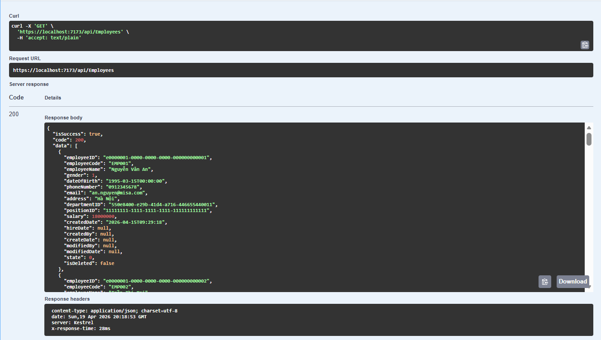
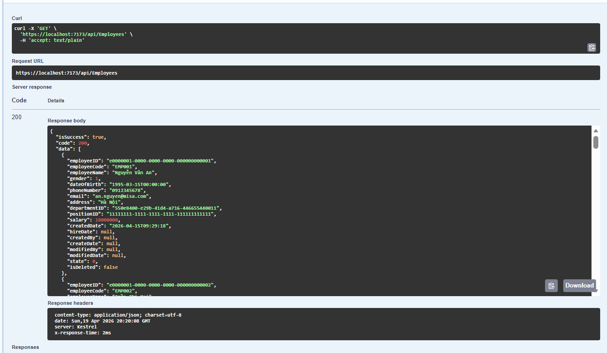
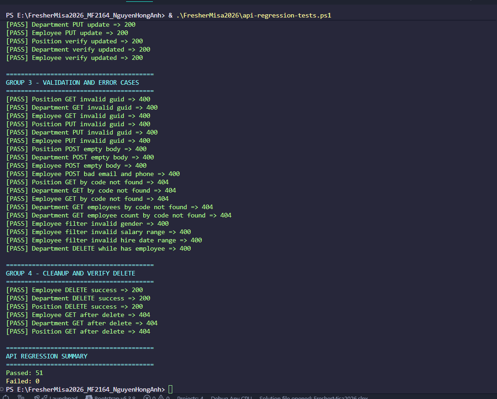

# feat (task-3.1) Refactor BaseRepository - Tối Ưu Performance

- `BaseRepository.cs`:
  - Chuyển sang tạo `MySqlConnection` mới cho từng lần truy vấn/thao tác để tận dụng connection pooling đúng cách.
  - Thêm `IMemoryCache` cho `GetEntitiesAsync` và `GetEntityByIDAsync` với thời gian sống cache là 5 phút.
  - Clear toàn bộ cache của entity khi có insert/update/delete thành công.
- `EmployeeRepository.cs`, `DepartmentRepository.cs`, `PositionRepository.cs`:
  - Chuyển các truy vấn đọc riêng sang dùng connection ngắn hạn thay vì dùng chung một connection instance.
- `FresherMisa2026.Infrastructure.csproj`:
  - Thêm package `Microsoft.Extensions.Caching.Memory` để dùng `IMemoryCache` ở tầng Infrastructure.
- `Program.cs`:
  - Đăng ký `AddMemoryCache()` để DI có thể cấp `IMemoryCache` cho repository.
  - Thêm middleware `ResponseTimeMiddleware` để gắn header `X-Response-Time` vào mọi response.

## Kiểm tra đã chạy
- Build solution: thành công.
- API regression test: `./api-regression-tests.ps1` chạy qua 51 case, tất cả pass.
- Response metadata:
  - API hiện trả thêm header `X-Response-Time` (đơn vị ms) cho từng request.
- Performance đo trên endpoint `GET /api/Employees`:
  - Lần đầu: khoảng 28 ms.
  
  - Các lần gọi tiếp theo là trung bình là 2ms.
  

## Các test trong `api-regression-tests.ps1`
  
- Mục tiêu: chạy regression end-to-end để xác nhận hệ thống vẫn ổn định sau khi tối ưu truy vấn và cache.
- Nhóm 1 - Smoke Read APIs:
  - Test các API đọc cơ bản cho Department, Position, Employee.
  - Bao gồm: danh sách (`GET /api/{entity}`) và phân trang (`GET /api/{entity}/paging`).
- Nhóm 2 - CRUD Success Flow:
  - Dùng dữ liệu test tạm thời (GUID mới mỗi lần chạy) để chạy đủ luồng thành công:
  - Create -> Get by Id -> Get by Code -> Update -> Verify Updated.
  - Bao gồm endpoint mở rộng:
  - `GET /api/employees/department/{departmentId}`
  - `GET /api/employees/position/{positionId}`
  - `GET /api/departments/{code}/employees`
  - `GET /api/departments/{code}/employee-count`
  - `GET /api/employees/filter`
- Nhóm 3 - Validation and Error Cases:
  - Kiểm tra các tình huống lỗi phổ biến và mã HTTP mong đợi:
  - ID sai định dạng GUID -> 400
  - Body rỗng khi tạo mới -> 400
  - Email/số điện thoại sai định dạng -> 400
  - Not found theo code -> 404
  - Filter sai range (`gender`, `salary`, `hireDate`) -> 400
  - Không cho xóa Department khi còn Employee -> 400
- Nhóm 4 - Cleanup and Verify Delete:
  - Xóa dữ liệu test theo thứ tự phụ thuộc: Employee -> Department -> Position.
  - Verify sau xóa: gọi lại theo Id phải trả 404.
  