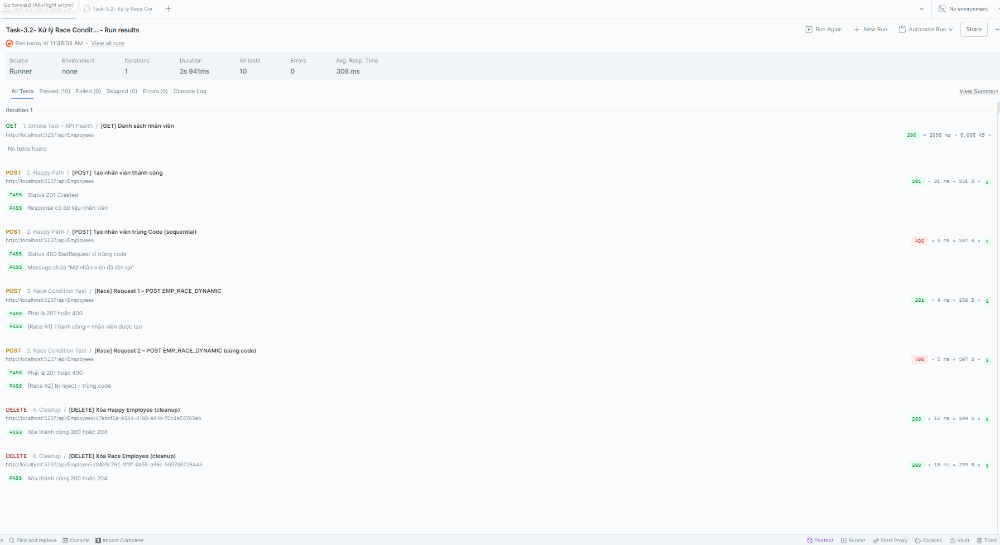

# feat (task-3-2) Xử Lý Race Condition trong Validate

- Thêm database-level constraint bằng unique index cho EmployeeCode.
- Bắt lỗi duplicate key từ MySQL (error 1062) trong global exception middleware.
- Map lỗi duplicate thành HTTP 400 với thông báo nghiệp vụ: Mã nhân viên đã tồn tại.
- Đảm bảo transaction ở repository vẫn rollback khi có exception, sau đó throw lại để middleware xử lý response.

Giải thích: 
- Validate ở service chỉ mang tính hỗ trợ, không đủ an toàn khi 2 api gửi cùng lúc.
- Unique index tại DB là điểm chặn cuối cùng và có tính nguyên tử.
- Dù 2 request vào cùng lúc:
  - Request đầu insert thành công.
  - Request sau vi phạm unique index, transaction rollback, API trả lỗi rõ ràng.

## Giải thích các case trong Postman JSON

File test sử dụng: `TestTask-3.2RaceCondition.json`.

### 1) Smoke Test - API Health
- Request: `GET /api/Employees`
- Mục đích: xác nhận API đang chạy đúng base URL trước khi test logic nghiệp vụ.
- Kỳ vọng: `200 OK`.

### 2) Happy Path

#### Case 2.1 - `[POST] Tạo nhân viên thành công`
- Request: tạo mới employee hợp lệ.
- Dữ liệu động được tạo ở pre-request script:
  - `happyEmployeeCode` (mã nhân viên cho luồng tuần tự).
  - `raceEmployeeCode` (mã nhân viên dùng cho 2 request race).
  - `happyEmployeeId`, `raceEmployeeId1`, `raceEmployeeId2` (GUID động).
- Mục đích:
  - Tránh fix cứng dữ liệu gây trùng khi chạy nhiều lần.
  - Chủ động gửi `employeeID` để tránh lỗi do `Guid.Empty`.
- Kỳ vọng: `201 Created`.

#### Case 2.2 - `[POST] Tạo nhân viên trùng Code (sequential)`
- Request: gửi lại cùng `happyEmployeeCode` ngay sau case 2.1.
- Mục đích: kiểm tra luồng duplicate theo kiểu tuần tự (không đồng thời).
- Kỳ vọng: `400 BadRequest` + message chứa `Mã nhân viên đã tồn tại`.
- Lưu ý assert message:
  - Test đang đọc fallback theo thứ tự `userMessage` -> `UserMessage` -> `data` -> `Data`.
  - Lý do: response hiện tại có thể trả message duplicate trong `Data`.

### 3) Race Condition Test

#### Case 3.1 - `[Race] Request 1`
#### Case 3.2 - `[Race] Request 2`
- Hai request dùng cùng `raceEmployeeCode`, nhưng khác `employeeID` (`raceEmployeeId1`, `raceEmployeeId2`).
- Mục đích: mô phỏng 2 request POST gần như đồng thời để kiểm tra điểm chặn ở DB unique index.
- Kỳ vọng tổng thể:
  - 1 request `201 Created`.
  - 1 request `400 BadRequest` với thông điệp duplicate.
- Vì sao cần khác `employeeID`:
  - Đảm bảo lỗi kỳ vọng là trùng `EmployeeCode`, không phải lỗi khác do trùng khóa chính `EmployeeID`.

### 4) Cleanup

#### Case 4.1 - `[DELETE] Xóa Happy Employee`
- Dọn dữ liệu tạo từ case 2.1.
- Nếu không có ID thì script đánh dấu skip để không fail giả.

#### Case 4.2 - `[DELETE] Xóa Race Employee`
- Dọn dữ liệu tạo từ request race trả `201`.
- Script tự chọn `employeeIdRace001` hoặc `employeeIdRace002`.
- Nếu không có ID thì skip để giữ kết quả test rõ ràng.

## Ý nghĩa kết quả pass/fail
- Pass đúng mục tiêu race condition khi đạt mẫu: `201 + 400` cho cặp race request.
- Nếu cả 2 request race đều `201`: DB chưa chặn unique đúng cách.
- Nếu có `500`: thường là lỗi khác ngoài duplicate business (cần xem response body để xác định nguyên nhân cụ thể).
