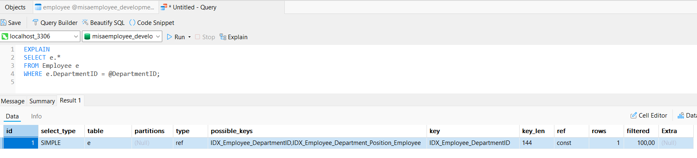
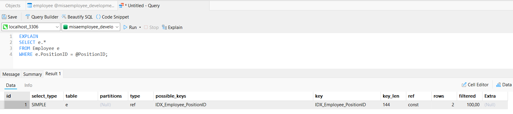
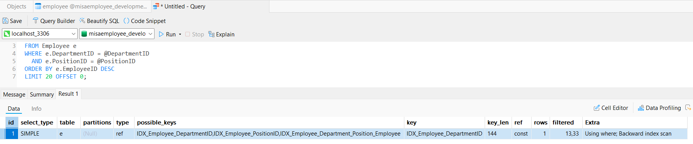
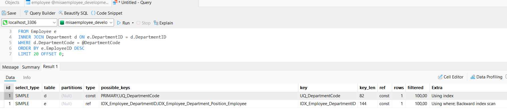

# Task 3.4: Toi Uu SQL Query voi Index

Tối ưu các truy vấn thường dùng trên bảng `Employee` để:

- Giảm full table scan khi filter theo `DepartmentID`, `PositionID`.
- Tăng tốc tìm kiếm theo `EmployeeCode`.
- Cải thiện truy vấn kết hợp nhiều điều kiện 

Các index đề xuất:

1. `IDX_Employee_DepartmentID` trên `(DepartmentID)`: phục vụ truy vấn lọc theo phòng ban và join qua khóa ngoại phòng ban 
2. `IDX_Employee_PositionID` trên `(PositionID)`: phục vụ truy vấn lọc theo vị trí
3. Composite index `IDX_Employee_Department_Position_Employee` trên `(DepartmentID, PositionID, EmployeeID)`: Tối ưu truy vấn thường gặp: filter theo phòng ban + vị trí + sắp xếp `EmployeeID DESC`.

**Ghi chú:** Unique index `UQ_EmployeeCode` từ task 3.2 đã tự động cover truy vấn tìm kiếm theo `EmployeeCode`, nên không thêm index ở task này nữa.

## Test

1. Test filter theo phong ban.

2. Test filter theo vi tri.

3. Test filter phong ban + vi tri + sap xep `EmployeeID DESC`.

4. Test join `Department` + `Employee` theo `DepartmentCode`.

