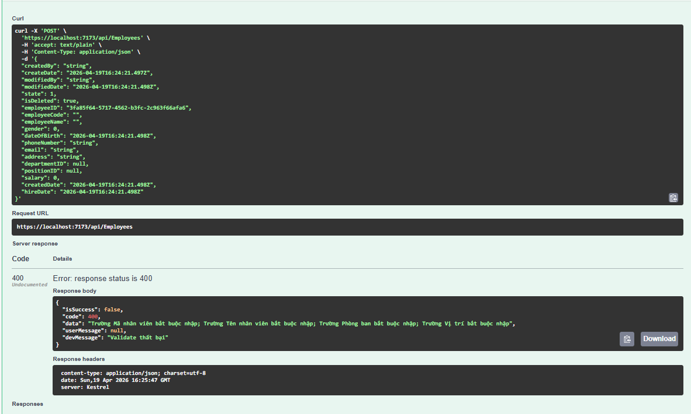
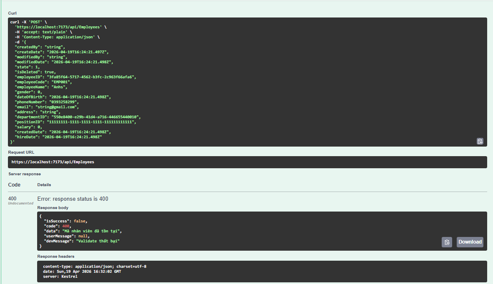
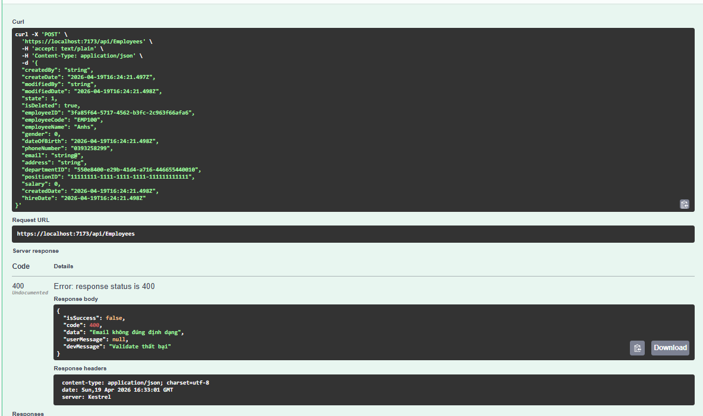

# Task 2.1: Thêm Validation cho Employee

## Luồng Validate hoạt động như thế nào?

Khi **Insert** hoặc **Update**, hệ thống sẽ chạy hàm `Validate()` — đây là **hàm phân luồng chính**, quyết định cần kiểm tra gì và theo thứ tự nào:

```
Validate(entity)
  │
  ├── Bước 1: Kiểm tra [IRequired] (bắt buộc nhập)
  │     → Duyệt tất cả property có gắn [IRequired]
  │     → Nếu CÓ LỖI → return lỗi NGAY, dừng tại đây
  │
  ├── Bước 2: ValidateCustom (đồng bộ - sync) 
  │     → Kiểm tra format email, SĐT, độ dài chuỗi, ngày sinh...
  │     → Không cần gọi DB, chạy nhanh trong bộ nhớ
  │
  └── Bước 3: ValidateCustomAsync (bất đồng bộ - async)
        → Chỉ dùng khi CẦN truy vấn DB (vd: kiểm tra mã nhân viên trùng)
        → return tất cả lỗi
```

### Lý do bổ sung thêm xử lý bất đồng bộ

Kiểm tra trùng mã mới cần `async` vì phải query DB. Những thứ kiểm tra được ngay trong bộ nhớ (null, format, length) thì dùng sync. 

### Kiểm tra

- POST employee thiếu các trường bắt buộc → trả về lỗi 400 với thông báo rõ ràng


- POST employee có mã trùng lặp → trả về lỗi "Mã nhân viên đã tồn tại"


- POST employee có email sai định dạng → trả về lỗi "Email không đúng định dạng"


