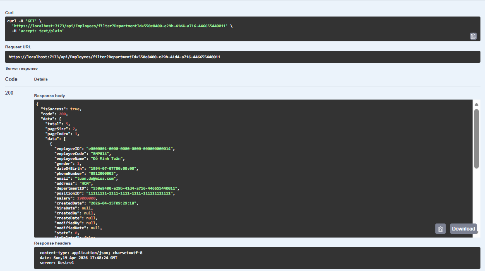
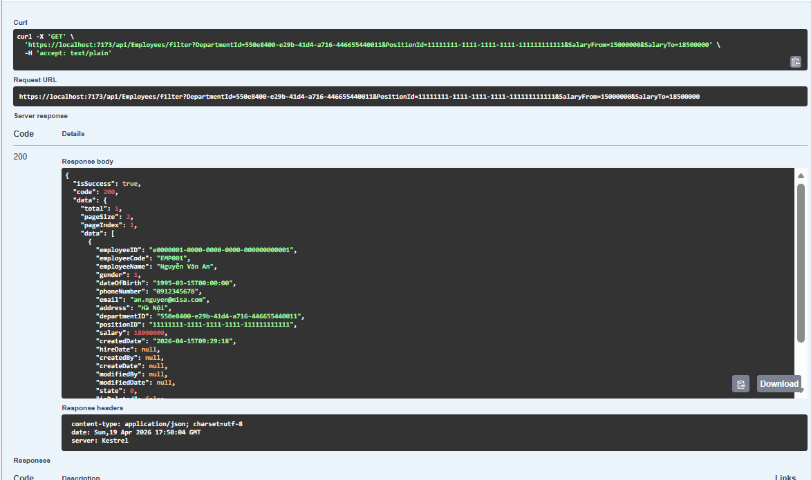
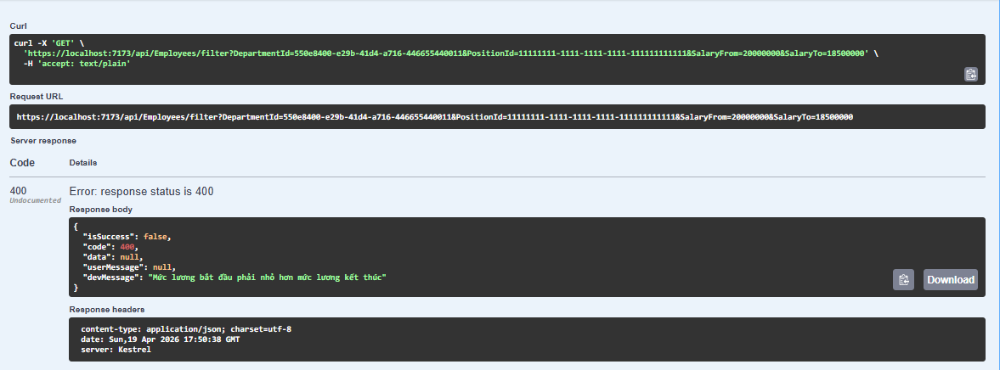

# Task 2.2 + Task 3.3: Endpoint Filter cho Employee

## Luồng Filter hoạt động như thế nào?

Khi gọi `GET /api/Employees/filter`, hệ thống sẽ nhận các tham số lọc từ query string và xử lý theo đúng thứ tự:

```
GET /api/Employees/filter
	│
	├── Bước 1: Bind query vào EmployeeFilterRequest (DTO)
	│     → departmentId, positionId, salaryFrom, salaryTo,
	│       gender, hireDateFrom, hireDateTo, pageSize, pageIndex, orderBy
	│
	├── Bước 2: Controller gọi EmployeeService.FilterEmployeesAsync()
	│
	├── Bước 3: Service validate dữ liệu đầu vào
	│     → gender chỉ nhận 0/1/2
	│     → salaryFrom <= salaryTo
	│     → hireDateFrom <= hireDateTo
	│     → pageSize <= 0 thì gán mặc định 2
	│     → pageIndex <= 0 thì gán mặc định 1
	│     → Nếu sai: trả về 400 BadRequest
	│
	├── Bước 4: Repository gọi Stored Procedure
	│     → Proc_Employee_FilterPaging_2
	│     → Truyền đầy đủ tham số lọc + phân trang + sắp xếp
	│
	├── Bước 5: Stored Procedure xử lý ở DB
	│     → Lọc theo các điều kiện (nếu tham số có giá trị)
	│     → Sắp xếp theo orderBy (salary/hireDate)
	│     → Trả 2 result set:
	│        1) Danh sách employee theo trang hiện tại
	│        2) TotalCount (tổng bản ghi thỏa điều kiện)
	│
	└── Bước 6: Service đóng gói kết quả
				→ Trả về PagingResponse<Employee> gồm:
					- Total
					- PageSize
					- PageIndex
					- Data
```

## Kiểm tra

- Gọi API với `departmentId` hợp lệ


- Gọi API với nhiều điều kiện lọc cùng lúc


- Gọi API với dữ liệu không hợp lệ


