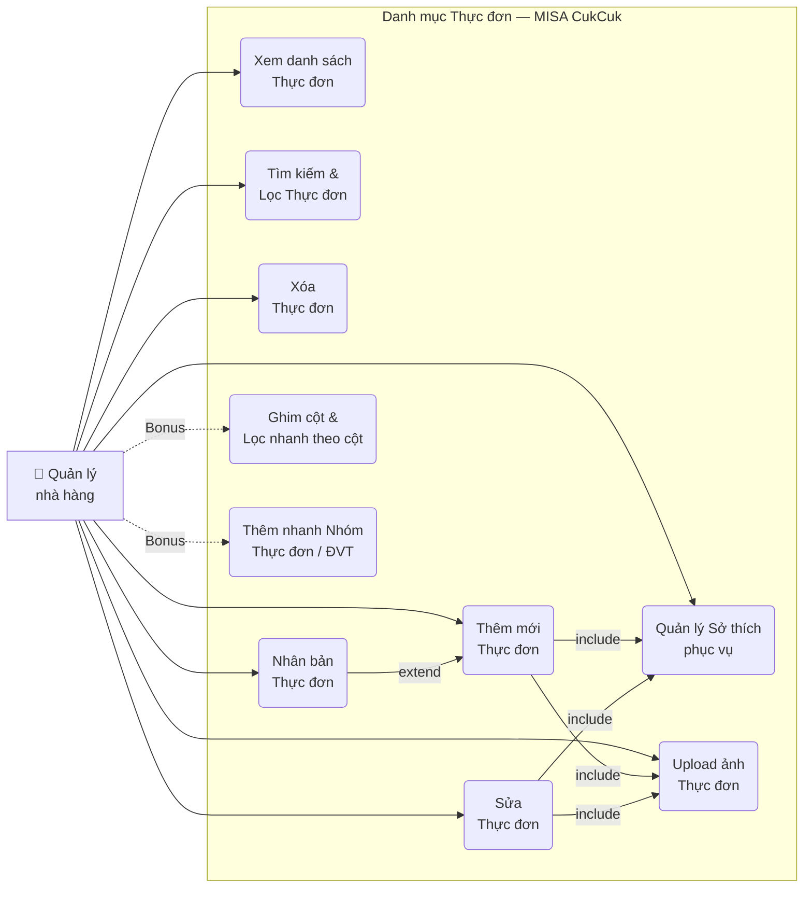
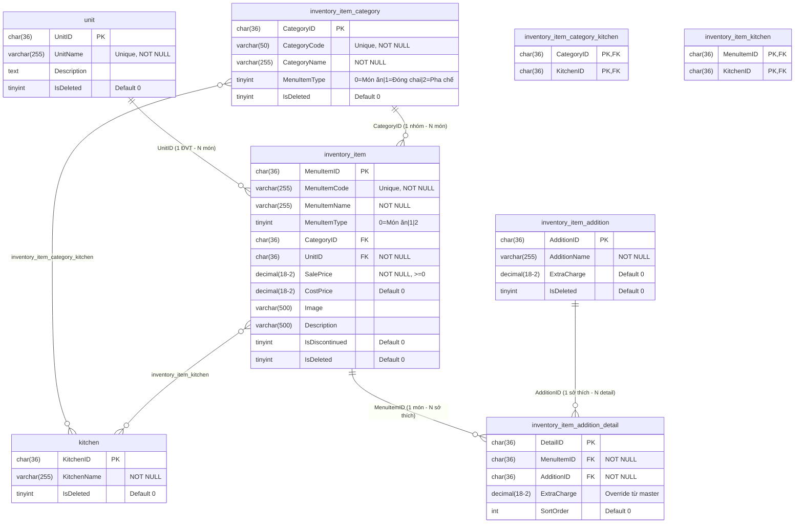
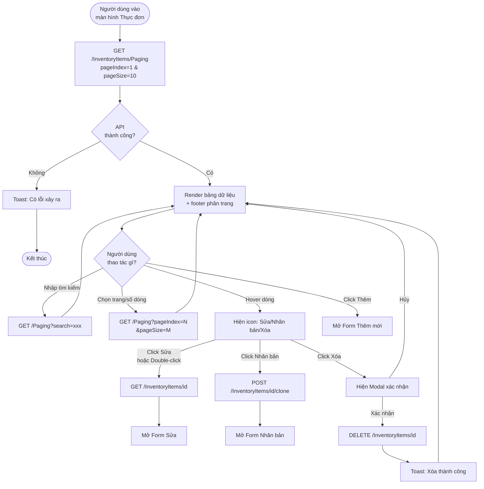
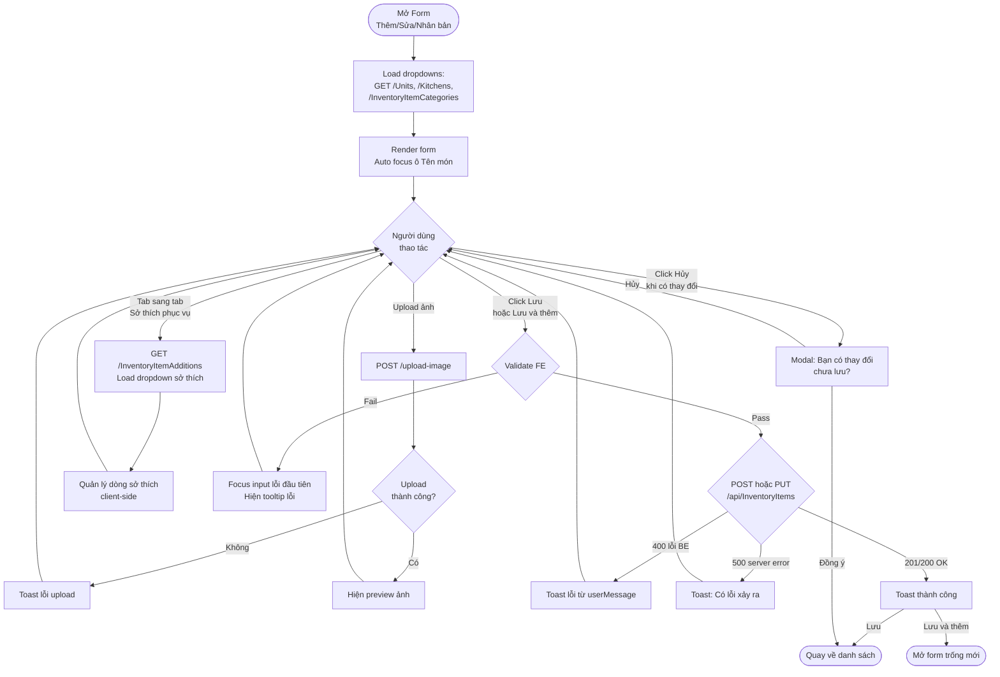
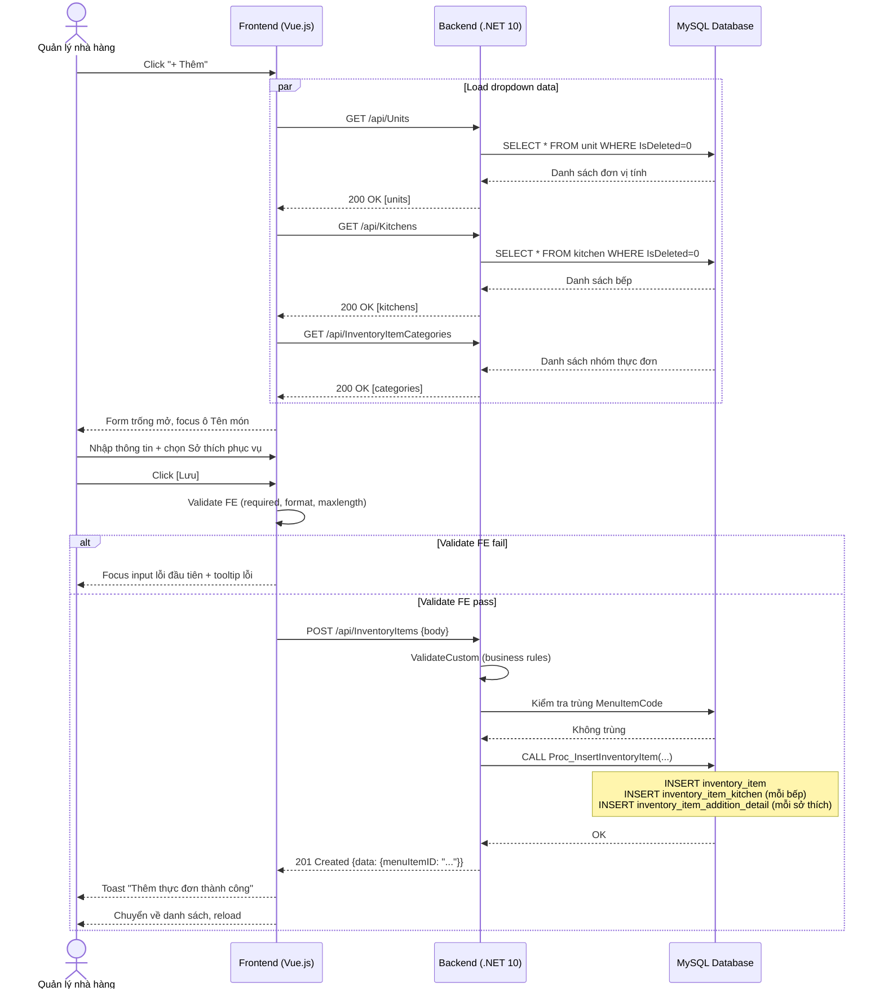
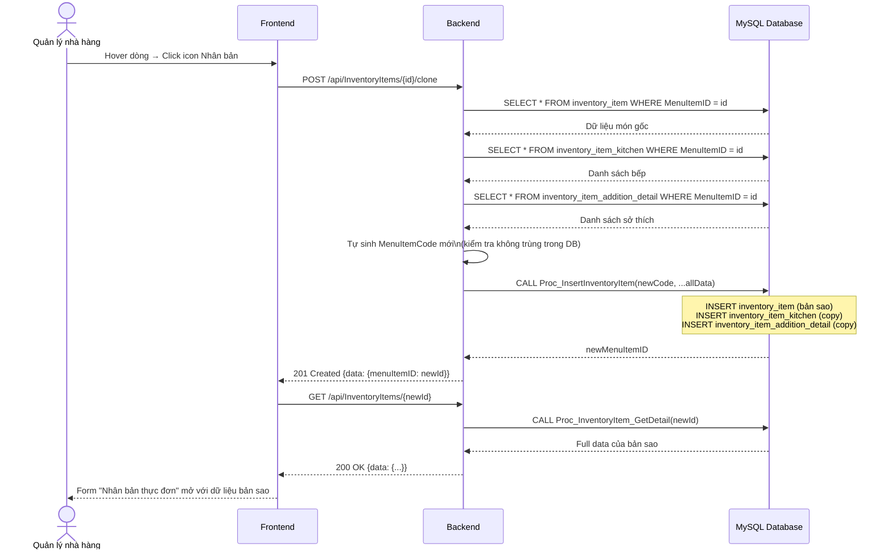
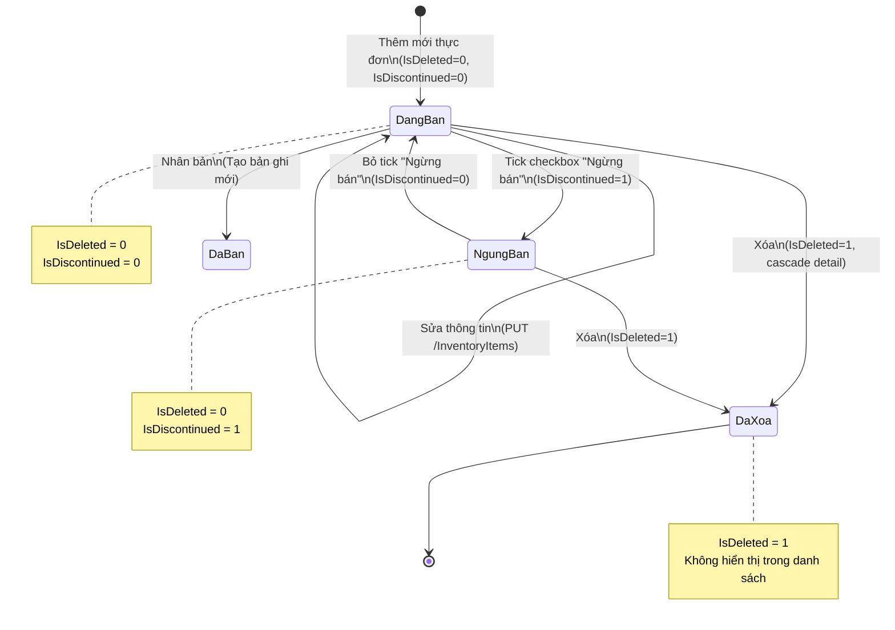
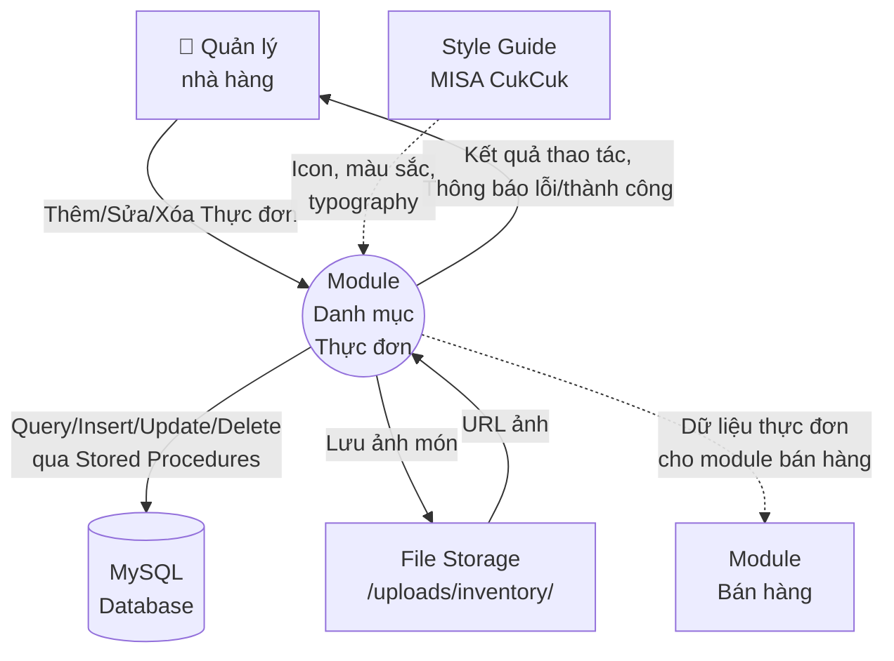
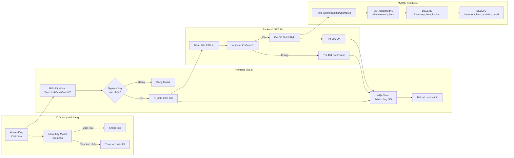

# Danh mục Thực đơn MISA CukCuk — Sơ đồ & Mô hình hóa

**Version:** 1.0  
**Ngày:** 18/05/2026  
**Công cụ:** Mermaid (render trong Markdown, GitHub, Notion, Confluence)

---

## 1. Use Case Diagram — Tổng quan tính năng hệ thống

> Mô tả toàn bộ chức năng của module và actor tương tác.

---

## 2. ERD — Entity Relationship Diagram

> Cấu trúc database, quan hệ giữa các bảng.

---

## 3. Flowchart — Luồng xử lý Màn hình danh sách

> Mô tả quy trình từ khi vào trang đến các thao tác chính.

---

## 4. Flowchart — Luồng xử lý Form Thêm / Sửa

> Quy trình nhập liệu và lưu dữ liệu.

---

## 5. Sequence Diagram — Luồng Thêm mới Thực đơn

> Tương tác chi tiết giữa Frontend, Backend API và Database.

---

## 6. Sequence Diagram — Luồng Nhân bản Thực đơn

---

## 7. State Diagram — Vòng đời của một Thực đơn

> Các trạng thái một món ăn có thể có trong hệ thống.

---

## 8. Context Diagram — Góc nhìn tổng thể hệ thống

> Module Danh mục Thực đơn trong hệ sinh thái MISA CukCuk.

---

## 9. Swim Lane — Quy trình xử lý Xóa Thực đơn

> Phân rõ trách nhiệm giữa các thành phần.

