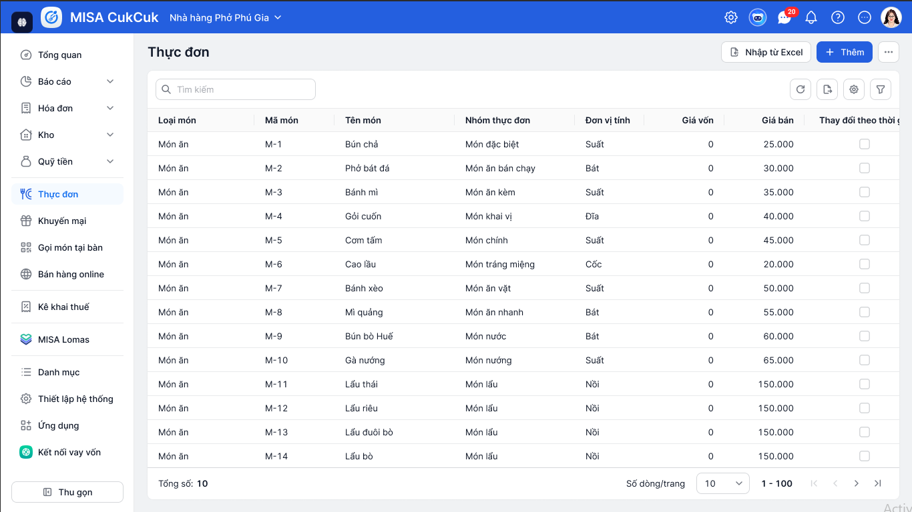
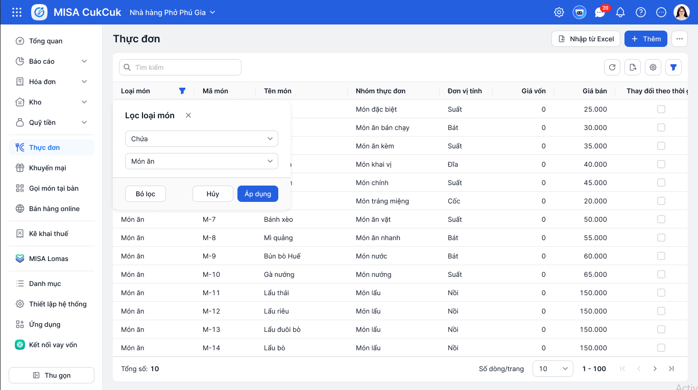
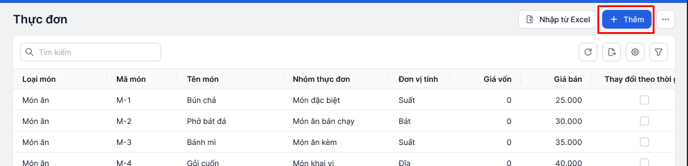
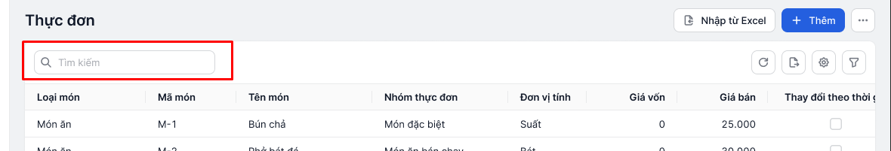
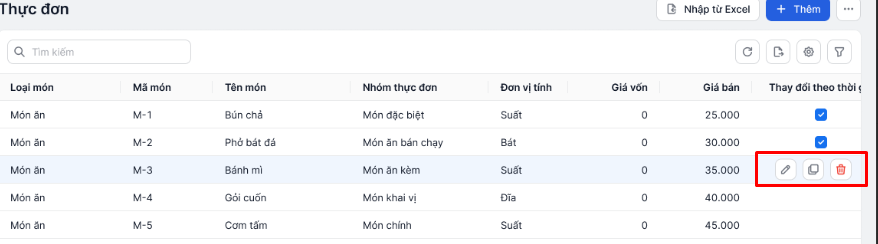
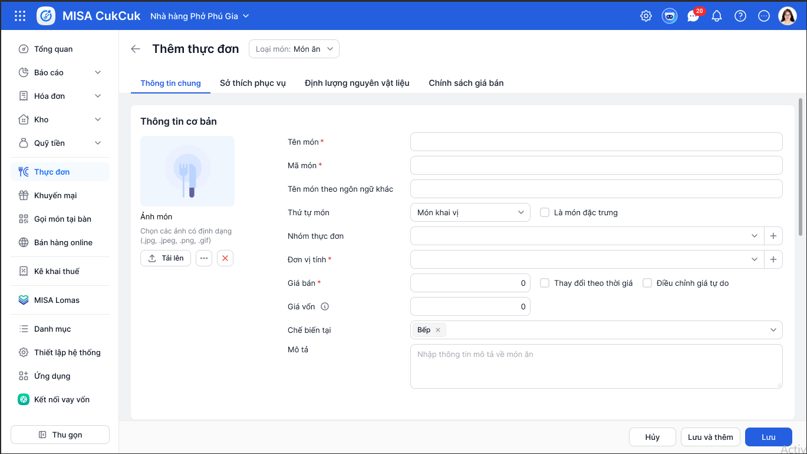
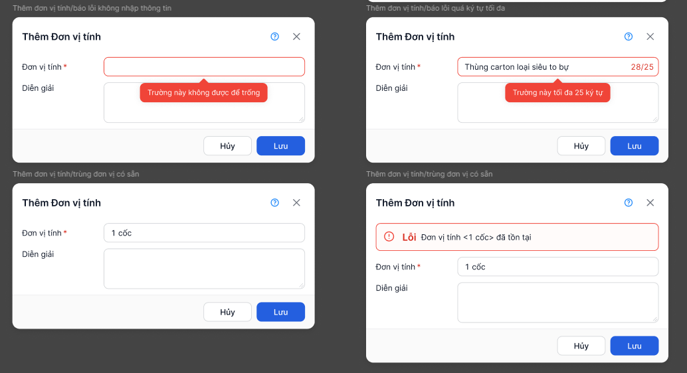
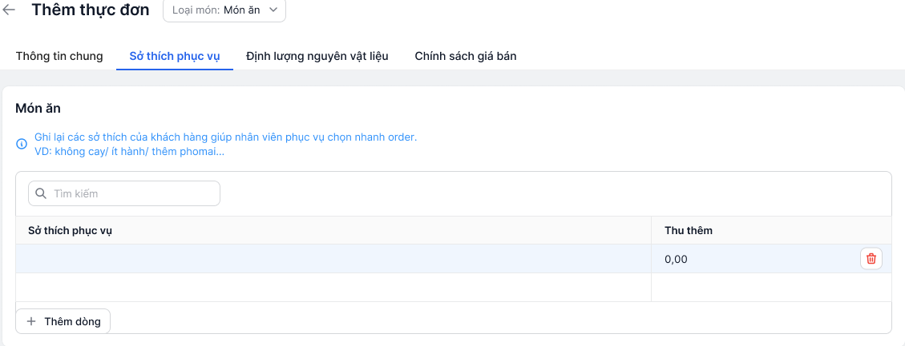
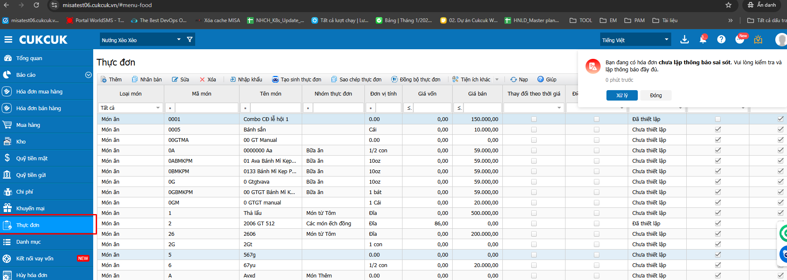

__BÀI TẬP ĐÁNH GIÁ CHƯƠNG TRÌNH ĐÀO TẠO FRESHER MISA WEB__

__XÂY DỰNG DANH MỤC THỰC ĐƠN – MISA CukCuk__

__I\.Nội dung yêu cầu__

__1\. Tổng quan yêu cầu__

Hệ thống danh mục thực đơn trong phần mềm MISA CukCuk cho phép quản lý toàn diện các món ăn, đồ uống trong thực đơn của nhà hàng\. Danh mục thực đơn cung cấp đầy đủ bộ công cụ để người dùng dễ dàng thực hiện các nghiệp vụ:

- Quản lý thực đơn: Thêm, sửa, xóa, nhân bản, nhập khẩu, sao chép, xuất khẩu, đồng bộ danh mục thực đơn\.
- Quản lý thông tin món ăn:
	- Quản lý các trường thông tin như: Loại món, mã món, mã vạch, tên món, nhóm thực đơn, đơn vị tính, giá vốn, giá bán, phí dịch vụ đặc biệt, thay đổi theo thời giá, điều chỉnh giá tự động,…
	- Tìm kiếm, lọc và sắp xếp món ăn theo nhiều tiêu chí \(mã món, tên món, loại món, nhóm thực đơn\)\.
- Tiện ích:
	- Sắp xếp thứ tự hiển thị món trên thực đơn, cập nhật ảnh minh họa, cập nhật giá hàng loạt\.
	- Chọn nhanh sở thích phục vụ khi thêm món, thiết lập chính sách giá theo khu vực, dừng bán món ăn, tự động sinh mã vạch, in tem mã, thiết lập nhóm ngành nghề, %tính thuế\.
- Tính năng nâng cao: Cho phép ghim cột, tùy chỉnh các cột dữ liệu trong bảng, lọc nâng cao theo nhiều tiêu chí cột hiển thị

__2\. Yêu cầu chi tiết__

Hãy xây dựng giao diện, API, Database hoàn thiện cho các chức năng trên cho riêng Danh mục Thực đơn theo các thiết kế \(hình ảnh giao diện\) có sẵn và được cung cấp trong mục UI đính kèm

1. Ứng dụng gồm Sidebar \(menu trái\) \+ Header\. Hai khu vực này chỉ cần dựng UI tĩnh, không yêu cầu chức năng\.
2. Màn hình danh sách Thực đơn: 

- Hiển thị danh sách theo phân trang, tìm kiếm theo Mã món/ Tên món; lọc nhanh theo Loại món, Mã món, Tên món, Nhóm thực đơn\.
- Thêm mới Thực đơn
- Nhân bản, sửa, xóa một thực đơn \(Hover vào từng dòng sẽ hiển thị icon Nhân bản, Sửa, Xóa\)
- __Cho phép ghim cột, tùy chỉnh độ rộng, Lọc nhanh trên các cột \(chọn làm hoặc không\)__

1. Màn hình chi tiết Thực đơn \(Chỉ làm tab __Thông tin chung__ và __Sở thích phục vụ\)__

- Đáp ứng nhập liệu, chọn các thông tin của thực đơn
- __Nhóm thực đơn, Đơn vị tính, Chế biến tại, Sở thích phục vụ__ có thể fix danh sách \(nhưng vẫn có bảng trong database và query từ database\)
- Đáp ứng Thêm, Xóa dòng sở thích phục vụ
- Upload ảnh thực đơn và xem lại được
- Thêm mới Nhóm thực đơn, Đơn vị tính \(chọn làm hoặc không, check trùng dữ liệu\)
- Mã món tự sinh theo tên món nhập vào, có check trùng \(chọn làm hoặc không\)

__Mục__

__Trạng thái__

__Nội dung__

__Header, Sidebar__

➡ Bắt buộc

Dựng UI tĩnh, không yêu cầu chức năng

__Màn hình Danh sách thực đơn  
__

➡ Bắt buộc

• Hiển thị bảng phân trang, Có button reload lại trang

• Tìm kiếm theo __Mã món/ Tên món__

• Hover vào dòng hiển thị các button Nhân bản, Sửa, Xóa

• Double click hiển thị form sửa

__Màn hình Chi tiết \(Thêm/Sửa/Nhân bản\)__

➡ Bắt buộc

• Chỉ làm tab __Thông tin chung \(Thông tin cơ bản\)__ và __Sở thích phục vụ__

• Validate quy tắc \(Không được để trống, Mã duy nhất, định dạng số – tiền tệ…\)

• Bấm phím Tab để chuyển các ô nhập liệu, mặc định auto focus ô input đầu và khi thực hiện validate thì auto focus vào ô input báo lỗi đầu tiên\.

• Xử lý upload và lưu trữ ảnh thực đơn

__Modal__

➡ Bắt buộc

• Hiển thị Modal thông báo \(Thoát form khi đang Sửa, Xóa, …\)

__Tooltip, Toast__

➡ Bắt buộc

• Hiển thị tooltip các button chỉ có icon

• Hiển thị Toast thông báo \(Thành công, Có lỗi xảy ra, …\)

__Validate__

➡ Bắt buộc

• __Tên món, Mã món, Đơn vị tính, Giá bán__: required

• __Mã Món__: unique

• __Mã Món, Tên Món theo ngôn ngữ khác__: max 255 ký tự

• __Mô tả__: max 500 ký tự

__CRUD API \+ DB__

➡ Bắt buộc

• API CRUD

• MySQL bảng tối thiểu:

- Bảng __inventory\_item __\(Danh sách thực đơn\)
- Bảng __inventory\_item\_category __\(Danh sách Nhóm thực đơn\)
- Bảng __unit __\(Danh sách đơn vị tính\)
- Bảng __kitchen __\(Danh sách bếp/bar chế biến\)
- Bảng __inventory\_item\_addition__\(Sở thích phục vụ\)

__Ghim cột, tùy chỉnh cột, lọc nhanh trên các cột__

➡ Bonus

• Ghim cột, Tùy chỉnh độ rộng cột

• Lọc nhanh trên các cột

__Thêm nhanh Nhóm thực đơn, đơn vị tính__

➡ Bonus

• Thao tác thêm nhanh Nhóm thực đơn, đơn vị tính khi Thêm, Sửa

*Gợi ý: *

- Sử dụng [__vue\-draggable\-next__](https://www.npmjs.com/package/vue-draggable-next) kéo thả cấu hình cột\.

__3\. Mô tả giao diện__

- __Tài nguyên icon \+ Màu style guide: __[__Tại đây__](https://drive.google.com/drive/folders/17M-QoN3mnB-5GIoj6E9rEACOqFtFaA0-)
- __Font: Inter  \(Có thể lấy từ CDN sau __[__https://testcdnamisapp\.misacdn\.net/fonts/font\.inter\.css__](https://testcdnamisapp.misacdn.net/fonts/font.inter.css)__ hoặc lấy trực tiếp từ google\)__
- __UI các màn hình __[__Tại đây__](https://drive.google.com/drive/folders/17uHpWLSuRrYMlhIadmUfNrhQsdAy_kj6)

*Màn hình danh sách Thực đơn*

*Chức năng Bộ lọc cột*

*Màn hình Chức năng thêm thực đơn*

*Chức năng Tìm kiếm*

	

*Chức năng sửa, nhân bản, xóa bản ghi trên danh sách*

**

*Form thêm/sửa/nhân bản*

**

*Dạng Tooltip validate*

**

*Form thêm sở thích phục vụ cho món*

__4\. Tham khảo__

Tham khảo trực tiếp nghiệp vụ sản phẩm \(do đây là UI mới đang triển khai, nên sẽ chỉ tham khảo nghiệp vụ\):

- Link: [https://misatest06\.cukcuk\.vn/\#menu\-food](https://misatest06.cukcuk.vn/#menu-food)
- User/Password: dev/123456Abc
- 

*Lưu ý: *

1. Chỉ thao tác trên dữ liệu tự thêm không được phép chính sửa các dữ liệu khác

__5\. Bảng đánh giá và chấm điểm__

__STT__

__Hạng mục đánh giá__

__Trọng số \(%\)__

__I__

__GIAO DIỆN \(UI/UX\)__

__50%__

1\.1

Tuân thủ đúng Style Guide

30%

1\.2

Responsive và kích thước màn hình >= 1366px

5%

1\.3

Font chữ và tài nguyên

5%

1\.4

Định dạng hiển thị dữ liệu

5%

1\.5

Hiển thị đầy đủ Modal

5%

__II__

__CHỨC NĂNG__

__50%__

2\.1

CRUD

20%

2\.2

Validate thông tin nhập liệu trên FE và BE

15%

2\.4

Phân trang và hiển thị

5%

2\.5

Tìm kiếm và lọc nhanh

5%

2\.6

Điều hướng bằng phím

5%

__TỔNG CỘNG__

__100%__

                                                                                  

*\-\-HẾT–*

