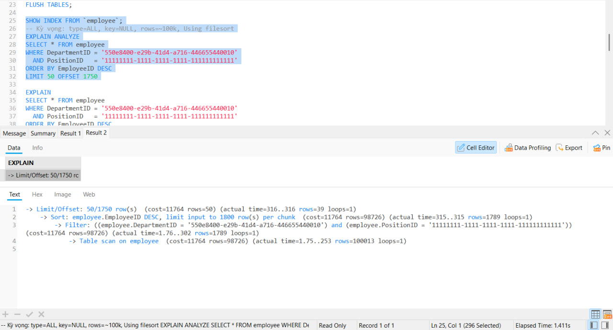
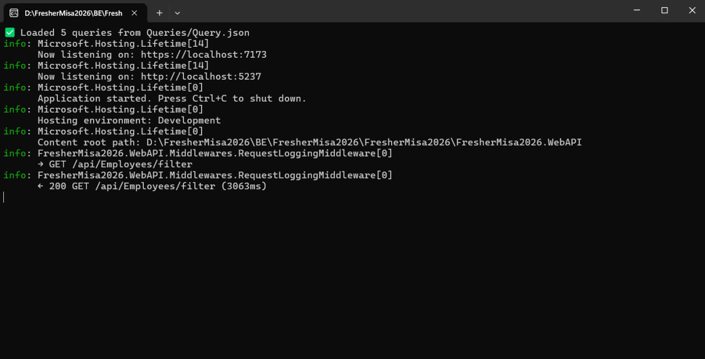
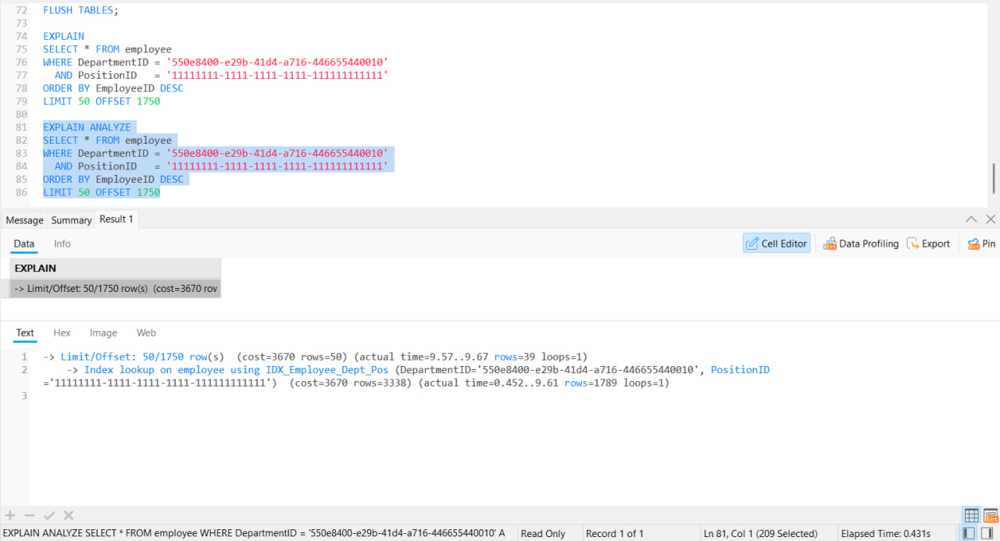
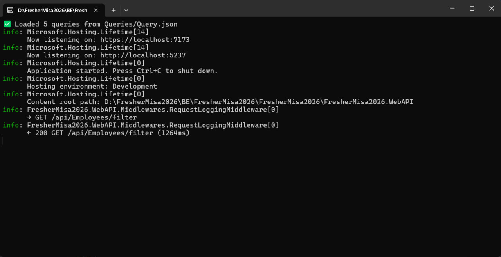

# Task 3.4 — Phân Tích Hiệu Năng Trước và Sau Khi Đặt Index

> **Môi trường test:** 100,000 bản ghi trong bảng `employee`  
> **Query test:** Filter theo `DepartmentID` + `PositionID`, trang cuối (`LIMIT 50 OFFSET 1750`)  
> **Công cụ đo:** `EXPLAIN ANALYZE` (tại DB) + Response time thực tế tại API (`GET /api/Employees/filter`)

---

## Query test

```sql
SELECT * FROM employee
WHERE DepartmentID = '550e8400-e29b-41d4-a716-446655440010'
  AND PositionID   = '11111111-1111-1111-1111-111111111111'
ORDER BY EmployeeID DESC
LIMIT 50 OFFSET 1750;
```

---

## TRƯỚC KHI ĐẶT INDEX

### Tại database — EXPLAIN ANALYZE



```
Table scan on employee          → quét 100,013 dòng   (actual time=1.75..253ms)
  → Filter DeptID + PosID       → còn lại 1,789 dòng  (actual time=1.76..302ms)
    → Sort EmployeeID DESC      → sort 1,789 dòng      (actual time=315..315ms)
      → Limit/Offset 50/1750    → lấy 39 dòng          (actual time=316..316ms)
```

| Chỉ số | Giá trị |
|---|---|
| Phương pháp | **Table scan** — quét toàn bộ bảng |
| Rows đọc | **100,013** dòng |
| Rows thực tế trả về | 1,789 dòng |
| Sort riêng | ✅ Using filesort |
| Cost | 11,764 |
| Thời gian tại DB | **316ms** |

### Tại API — Response time



```
← 200 GET /api/Employees/filter (3063ms)
```

> API mất **3,063ms** — bao gồm thời gian DB (316ms) + overhead network, mapping, serialization JSON 100k dòng.

---

## Index được tạo

```sql
-- Composite index: filter DeptID + PosID + sort EmployeeID DESC trong 1 index
CREATE INDEX `IDX_Employee_Dept_Pos`
  ON `employee` (`DepartmentID`, `PositionID`, `EmployeeID` DESC);

-- Index riêng cho PositionID khi không có DepartmentID trong filter
CREATE INDEX `IDX_Employee_PositionID`
  ON `employee` (`PositionID`);

-- Equality DepartmentID trước, range Salary sau
CREATE INDEX `IDX_Employee_Dept_Salary`
  ON `employee` (`DepartmentID`, `Salary`);

-- Equality DepartmentID trước, range HireDate sau
CREATE INDEX `IDX_Employee_Dept_HireDate`
  ON `employee` (`DepartmentID`, `HireDate`);

-- FULLTEXT thay thế LIKE '%keyword%' không dùng được B-Tree index
ALTER TABLE `employee`
  ADD FULLTEXT INDEX `FT_Employee_Search`
    (`EmployeeName`, `EmployeeCode`, `Email`, `Address`);
```

---

## SAU KHI ĐẶT INDEX

### Tại database — EXPLAIN ANALYZE



```
Index lookup on IDX_Employee_Dept_Pos  → đọc 1,789 dòng  (actual time=0.452..9.61ms)
  → Limit/Offset 50/1750               → lấy 39 dòng      (actual time=9.57..9.67ms)
```

| Chỉ số | Giá trị |
|---|---|
| Phương pháp | **Index lookup** — nhảy thẳng vào đúng nhóm dòng |
| Rows đọc | **3,338** dòng |
| Rows thực tế trả về | 1,789 dòng |
| Sort riêng | ❌ Không cần — EmployeeID DESC có sẵn trong index |
| Cost | 3,670 |
| Thời gian tại DB | **9.67ms** |

### Tại API — Response time



```
← 200 GET /api/Employees/filter (1264ms)
```

> API còn **1,264ms** — DB chỉ còn 9.67ms, phần còn lại là overhead serialization JSON.

---

## Tổng kết so sánh

| | Trước index | Sau index | Cải thiện |
|---|---|---|---|
| **Phương pháp DB** | Table scan | Index lookup | |
| **Rows đọc** | 100,013 | 3,338 | giảm **97%** |
| **Using filesort** | ✅ Có | ❌ Không | loại bỏ hoàn toàn |
| **Cost** | 11,764 | 3,670 | giảm **69%** |
| **Thời gian DB** | 316ms | 9.67ms | nhanh hơn **~33 lần** |
| **Response time API** | 3,063ms | 1,264ms | nhanh hơn **~2.4 lần** |

---

## Nhận xét

**Tại DB** cải thiện ~33 lần nhờ 2 yếu tố:
- Rows đọc giảm 97% — MySQL nhảy thẳng vào nhóm dòng đúng thay vì quét toàn bảng
- Loại bỏ filesort — `EmployeeID DESC` đặt cuối index giúp sort được thực hiện miễn phí trong lúc đọc index

**Tại API** cải thiện ~2.4 lần (3,063ms → 1,264ms) — mức cải thiện thấp hơn DB vì phần lớn thời gian còn lại là **serialization JSON** của tập kết quả, không liên quan đến index. Để cải thiện thêm cần tối ưu phía application (phân trang, lazy loading, projection thay vì `SELECT *`).